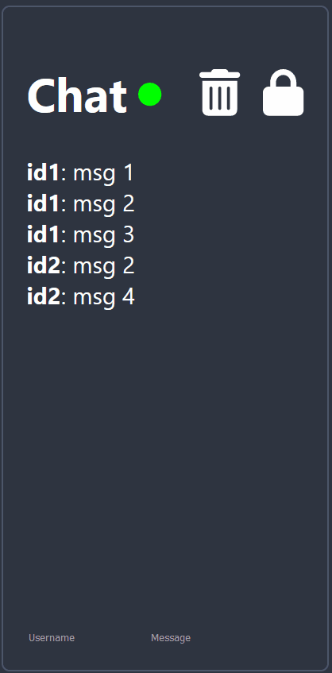
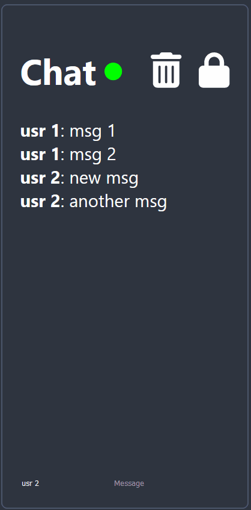

# Web Chat

Web Chat written in React + Flask.

## Design Overview

### Frameworks

### Description

Frontend written with React + Typescript and backend written with Flask + websockets. Hosting was done using heroku with separate instances for frontend and backend.

Frontend hosting uses a node buildpack, while backend hosting uses Gunicorn for speed and scalability, along with Redis to allow for worker communications. Redis is necessary as When a client connects to the chat, their websocket belongs to a single Gunicorn worker. If we want to broadcast an update to all connected users that a message has been sent, then we need a method for a single Gunicorn worker to communicate with all workers, which can be done with Redis.

DB for messages is an Essential 0 Postgres attached to the backend instance.

## Current features

Status indicator of whether connection is online

Ability to clear chat for all users

Unlockable autoscroll

Ability to rearrange chat messages

## Demo

